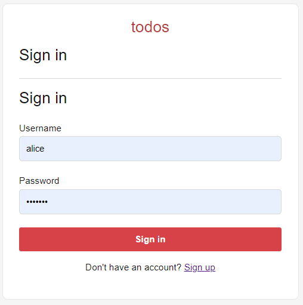
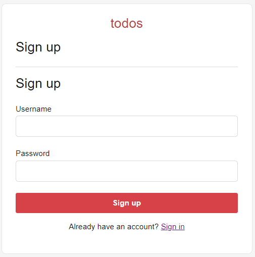

<h2>Passport.js in ES6</h2>

<h3>Description:</h3>
  <ul style="list-style-type:disc">
    <li><a href="https://www.passportjs.org/">PassportJS</a> tutorial <a href="https://www.passportjs.org/tutorials/password/">username & password</a> relevant syntax re-written for ES6.</li>
    <li>The Passport.js example uses <a href="https://www.npmjs.com/package/connect-sqlite3">connect-sqlite3</a> which is an SQLite3 based session store for Express.</li>
  </ul>

  

    
    
  

   
  
<h3>How to use</h3>

##
npm install

##
node ./app.js

<h3>Expected Output</h3>
<pre>
Server running at http://localhost:4000/
</pre>

<h3>Requirements</h3>
 
<a href="https://expressjs.com/">ExpressJS (~4.16.1)</a>, <a href="https://nodejs.org/en">NodeJS (20.0)</a> and <a href="https://www.passportjs.org/">Passport.js (^0.7.0)</a>.
